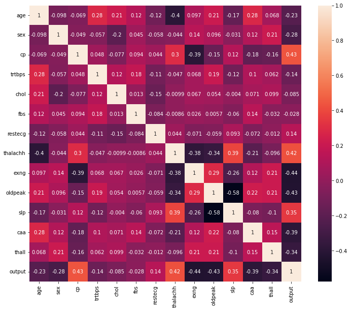

# Applying Logistic Regression Manually to the Heart Data Without Using the sklearn Library

In this repository, we tried to predict the heart attack data without using the sklearn library as much as possible. Our purpose is to predict the heart attack data correctly. Since the output data can take two values, which are 0 and 1, it is reasonable to use logistic regression classification. In essence, we can apply the logistic regression by sklearn easily. However, in order to learn the math, which is in the background, we did not use sklearn.

### Data:

* ***age:*** Age of the person (int)

* ***sex:*** Gender of the person (int)

* ***cp:*** Chest pain type (int)

* ***trbps:*** Resting blood pressure (in mm Hg) (int)

* ***chol:*** Cholestoral in mg/dl fetched via BMI sensor (int)

* ***fbs:*** Fasting blood sugar (fbs > 120 mg/dl) (1 = true; 0 = false) (int)

* ***restecg:*** Resting electrocardiographic results (int)

* ***thalachh:*** Maximum heart rate achieved (int)

* ***exng:*** Exercise induced angina (1 = yes; 0 = no)

* ***oldpeak:*** Previous peak (int)

* ***slp:*** Slope (int)

* ***caa:*** Number of major vessels (int)

* ***thail:*** Maximum heart rate achieved (int)

* ***output:*** Target variable (0 = less chance of heart attack; 1 = more chance of heart attack) (int)

### Correlation Matrix:

### Sources:

https://www.kaggle.com/datasets/rashikrahmanpritom/heart-attack-analysis-prediction-dataset

https://www.kaggle.com/code/kanncaa1/deep-learning-tutorial-for-beginners
